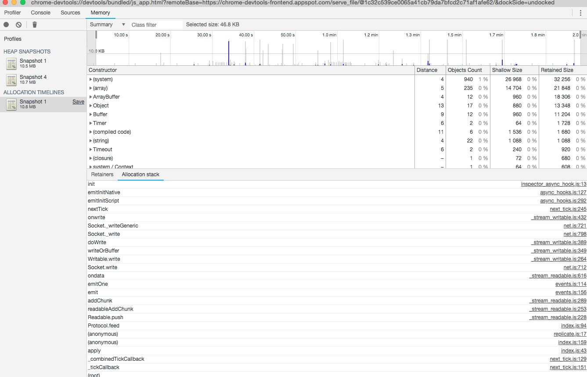

# A simple example to demonstrate memory leak

I am not sure where the memory leak lies, it could be in hyperdb replication or in the discovery layer.

To replicate run:

1. `npm i`
2. `node --inspect index.js`
3. Open up chrome to inspect node process
4. Force clear on GC and take a heap snapshot
5. Wait 10 minutes and force clear on GC and take another heap snapshot
6. Notice the difference in heap size
7. Run Allocation Instrumentation on timeline to see memory allocation in real time. Blue spikes represent uncollected memory.

This it looks like leaks only occur when a peer is connected.

